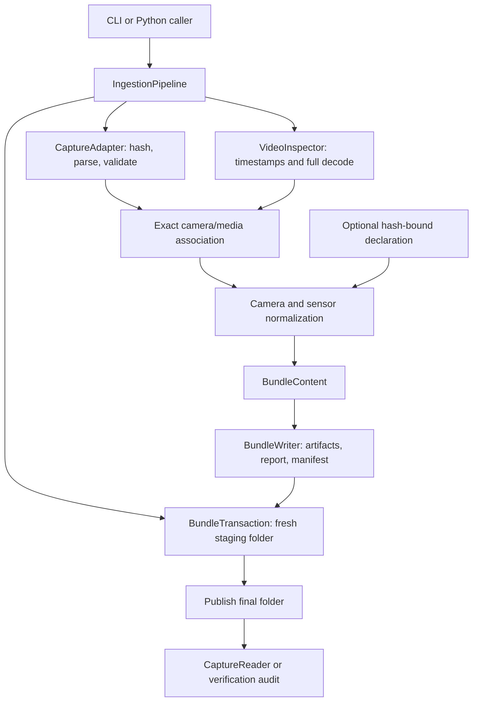

# Ingestion architecture

**Current automatic workflow (2026-10-04):** Automatic uploads now execute verified ingestion, verified preprocessing, bounded fixed-pose sparse reconstruction, CUDA dense stereo, audited surface extraction, provisional floor/wall/ceiling estimation and atomic viewer publication. CPU runtimes retain an explicitly labelled sparse preview within one isolated job. Existing prepared captures create immutable reconstruction children; failed later stages retain verified inputs for retries. HTTP only admits/reads work. [Design and limitations](AUTOMATIC_RECONSTRUCTION.md).


## Separate reconstruction stage

`boundaries/` consumes fully verified surface evidence through frozen request/policy objects. Review admission binds every convex image region to exact source RGB/frame/time/grid and observation hashes. Pure geometry functions retain a local floor hypothesis and only sufficiently supported wall intervals; analysis limits semantics to reviewed accepted samples and gives explicit exclusions priority. Presentation supplies offline SVG/PNG and source-linked image overlays. Coordination archives original/canonical review bytes and publishes atomically after an independent full-chain recomputation. Optional grounding is audited for provenance/status only and cannot change boundary geometry. Native `cozmo-boundaries` and the CPU Docker `boundaries` target share this application boundary; no closure, snapping, scale/pose correction or HTTP dependency is introduced. [Contract/results](PARTIAL_BOUNDARIES.md), [module ownership](src/cozmo_reconstruction/boundaries/README.md).

`grounding/` is an independently invoked local-reference diagnostic. Frozen policy/request, source-bound corner admission, pure IPPE alternatives/ray triangulation, evidence analysis, offline editor and recomputing verifier have separate ownership. The coordinator audits ingestion/prepared and optional dense/surface chains, archives exact external annotation bytes, hashes every artifact and publishes atomically. PnP uses declared dimensions while unconstrained triangulation checks size separately. Missing support, unreviewed marks, planar ambiguity and unknown thickness stay explicit. `cozmo-grounding` and the CPU `grounding` Docker target never alter baseline scale/poses or confirm architectural semantics. [Contract/findings](GROUNDING.md), [module ownership](src/cozmo_reconstruction/grounding/README.md).

Reviewed v2 grounding reports separately archive human confirmation bound to original annotation/video hashes and every marked rank. `confirmation.py` validates thickness bounds and propagates signed interval endpoints; `diagnostics.py` isolates controlled object-pose refinement, pixel-center shifts, holdouts and point fitting from the unchanged acceptance path. Verification recomputes those results and can use archived inputs without external review files. Historical v1 reports retain their earlier interpretation. [Reviewed investigation](GROUNDING_DIAGNOSTICS.md).

After dense verification, `surfaces/` runs bounded deterministic NumPy plane fitting on the immutable voxel cloud. Separate geometry, observation analysis and presentation modules retain per-view accepted-depth lineage, classify provisional orientation/height, flag weak or ambiguous patches and create focused RGB evidence. Its coordinator audits all upstream inputs, guards actual raw roots, stages/hashes results and recomputes planes, labels, residuals and patches before publication. No architectural identity is automatically confirmed; unoccupied cells and unassigned points stay explicit. It runs through `cozmo-surfaces` natively or the CPU `surfaces` Docker target. [Contract/findings](SURFACES.md).

`cozmo_reconstruction` consumes source-audited Sensor Recorder preprocessing. Its typed request/policy, prepared reader, pure optical-camera conversion, injected backend protocol and bounded PyCOLMAP CPU subprocess separate camera conventions from backend lifecycle. The sparse pipeline stages images/model/database/track artifacts, rechecks sources, independently verifies fixed cameras and database feature lineage, then publishes atomically. [Sparse contract/results](RECONSTRUCTION.md), [module ownership](src/cozmo_reconstruction/README.md).

Its dense subpackage takes a verified sparse model through a separate source audit and immutable depth policy. An injected CUDA worker derives image grids/K while holding source poses fixed, then estimates RGB stereo Z. Pure geometry functions compute independent depth/reprojection/parallax masks and source-world voxel averages. The coordinator hashes all artifacts, rechecks inputs, recomputes masks/cloud/report and audits actual model cameras before atomic publication. CPU and CUDA distributions use mutually exclusive uv extras; native CPU verifies the GPU outputs. No captured depth/grounding, scale fitting, pose optimization or HTTP dependencies enter that geometry path. [Dense design/results](DENSE_RECONSTRUCTION.md). Floorplan/mesh/HTTP reconstruction remain later stages.

## Separate preprocessing stage

`cozmo_preprocessing` consumes the verified ingestion bundle through `CaptureReader(profile="ios_preprocessing")`. Its immutable policy/request, injected FFmpeg decoder, indexed sensor statistics, quality/selection functions, cached image matcher and publication/audit service have separate ownership. Derived views retain exact source K/poses and independent IMU; native-grid image exports are not geometrically transformed. Depth/confidence, reference dimensions/photo, magnetometer and fused motion are excluded. [Detailed contract](PREPROCESSING.md), [package ownership](src/cozmo_preprocessing/README.md).

Holo queues a separate preprocessing job from an existing successful Sensor Recorder capture. The isolated worker audits the parent, copies its portable raw/bundle/reference layout without altering it, prepares derived artifacts, audits them and publishes a new history result. Parent captures remain immutable. Preview routes admit selected frame ranks only; report/export routes verify the full source-bound derived bundle. No reconstruction or reference-scale correction runs.

The ingestion domain processes one complete capture folder into a canonical bundle. It remains usable as a local batch package independently of the optional web interface. Source-specific adapters support the observed Sensor Recorder exports and the provided Stray-style captures. Layout selection is isolated in `adapters/selection.py`; no reconstruction dependency is introduced.

## Optional web application

Published reconstruction display has a separate offline `viewer/` publisher and read-only web `ReconstructionCatalog`. The publisher audits the complete existing chain and creates rigid display coordinates, bounded binary RGB points, unfilled plan occupancy and explicit provisional geometry. Eight assets bind their parent manifests and publish atomically. HTTP admits only configured-root result IDs and fixed hash-checked assets; it neither imports reconstruction engines nor accepts arbitrary paths. The lazy frontend tab renders independent plan and Three.js components, disposes GPU/network resources on unmount and retains loading/empty/error states. [Viewer contract and portability](RECONSTRUCTION_VIEWER.md).

The sibling `cozmo_web` package wraps the existing domain. `app.py` owns HTTP/lifecycle composition; `config.py`/`schemas.py` validate settings and reference metadata. `uploads.py` copies/extracts bounded, byte-preserving captures and validates cross-platform paths. `repository.py` owns atomic JSON records and an OS-released single-instance lock. `jobs.py` manages one queue slot, `runner.py` starts/terminates isolated process trees, and `worker.py` imports the existing pipeline and verifier. `exports.py` checks source/artifact integrity before producing a portable raw/annotations/bundle archive. `reference_images.py` validates optional JPEG/PNG attachments in the web worker, stores original bytes separately from raw capture observations, binds image/metadata hashes to the video and guards result/download access. Presentation code is excluded from the core source fingerprint.

The React/TypeScript frontend has guide and ingestion features, a typed API client and a shared Markdown renderer. `capture.md` supplies protocol/settings; raw HTML is disabled. Tabs retain component state while switching. Docker/native compiled mode serves static assets through FastAPI; Vite proxies the same relative API paths during development. [Setup](WEB_SETUP.md), [results](WEB_RESULTS.md).

This is single-instance local storage. One Uvicorn worker runs one isolated processing job plus a bounded queue. Startup marks interrupted receiving/processing jobs failed and resumes untouched queued jobs; shutdown terminates and awaits worker/media process trees. Retry is a new run. CLI transactional publication remains separate from HTTP job status.

New canonical text explicitly uses UTF-8/LF; CSV explicitly retains CRLF. Root hints use POSIX separators; readers also accept historical Windows hints. Some historical byte hashes differ because of intentional serialization/path changes; parsed observation values remain preserved.

## Layout and ownership

```text
proto-2/
  pyproject.toml           Package, CLI, build and lint configuration
  uv.lock                 Runtime/development dependency resolution
  .python-version         Default interpreter: Python 3.12
  src/cozmo_ingestion/
    pipeline.py           IngestionPipeline application service
    models.py             Typed request, source, observation and result objects
    contracts.py          Canonical schema and immutable validated policy
    ports.py              CaptureAdapter and VideoInspector protocols
    adapters/
      sensor_recorder.py          Export parsing, validation and asset inventory
      sensor_recorder_schema.py   Supported headers, version identity and roles
      selection.py                Explicit layout selection and video filename
      stray.py                    Provided native CSVs and initial-discard clock audit
    media.py              FFmpegVideoInspector and external process boundary
    clocks.py             Exact frame association and native coverage statistics
    numeric.py            Finite decimal parsing and quaternion pose conversion
    annotations.py        Hash-bound user declarations and candidate intervals
    normalization.py      Camera/sensor records and quality findings
    bundle.py             BundleWriter and BundleTransaction
    storage.py            Deterministic encoders, path checks and BundleIntegrity
    reader.py             CaptureReader input profiles and access log
    verification.py       Source-specific audit dispatch and Sensor Recorder verification
    stray_verification.py Native Stray source-to-bundle audit and replay comparison
    errors.py             Stable validation error codes
    cli.py                Argument parsing and exit-code presentation
  tests/                  Behavioral tests and reusable synthetic fixtures
  capture_annotations/    Explicit declarations for the supplied recordings
  outputs/                Ignored generated captures and local validation evidence
```

## Object and dependency design

`IngestionPipeline` coordinates work; it owns neither CSV syntax nor file serialization. Its constructor accepts a source adapter, video inspector, bundle writer and immutable policy. Defaults configure the supported iOS path, while tests inject a fake media inspector or a failing writer.

The protocols in `ports.py` define the source and external-media boundaries structurally. Implementations do not need a shared inheritance tree. Classes own behavior with state/lifecycle; stateless numerical and record transformations remain functions. No global run state or service locator is used.

The main typed objects are:

- `IngestionRequest`: source/output paths and optional annotation input.
- `SourceCapture`: validated metadata, camera records and native sensor tables/comments.
- `VideoInspection`: actual decoded-frame timing/grid and inspection commands.
- `CameraObservations` / `SensorObservations`: independent normalization outputs.
- `CanonicalObservations`: combined records, coverage and findings.
- `BundleContent`: validated content handed to storage.
- `RunMetadata`: execution-specific timing/tool data, separated from capture content.
- `IngestionResult`: manifest, validation report and published output path.

Dictionary records preserve the existing JSON/CSV schema and exact source strings; dataclasses establish component boundaries. Future geometric domain objects belong to preprocessing/reconstruction rather than this ingestion contract.

## Lifecycle



1. Resolve the request; reject existing outputs and source/output overlap. Create a unique staging folder.
2. Inventory original assets and hash them. The adapter validates the export's version, finished ARKit state, stream schemas, units and coordinate declarations.
3. Inspect actual media presentation timestamps and fully decode video through FFmpeg. Resolve tools through explicit paths or `PATH` only.
4. Require exact frame counts/sequential source IDs and relative camera/media clock agreement. Use rational PTS ticks and decimal source times; Sensor Recorder uses a constant-offset check. Stray requires exactly one initial negative-PTS discarded packet, decoded rank i → odometry ID i+1 and an affine clock fit (slope within 1%, maximum residual ≤10 ms). The unmatched first pose remains a separate artifact; no pixels/poses are edited.
5. Bind optional reference declarations to the exact video. Mark candidate frames while preserving `NOT_RUN` localization/scale status.
6. Independently normalize camera records and sensor tables. Retain native pixels, source world, tracking states, sensor values and timestamps; collect findings without repairing geometry.
7. Recheck source/annotation hashes. Write canonical records, metadata, validation and artifact hashes; record a fingerprint of all package Python modules with normalized source line endings.
8. Publish by renaming the staging folder on the same filesystem. Return the completed result. Failures retain `FAILED` diagnostics and do not publish a final bundle.

## Contracts and failure handling

Structural failures raise `IngestionError(code, message)`. Examples include unsupported export versions, malformed/empty tables, duplicate/nonmonotonic timestamps, count mismatch, invalid calibration and modified sources. The CLI returns a nonzero exit code and writes errors to stderr. `BundleTransaction` converts unexpected processing/storage failures into failed diagnostics.

Quality limitations are report findings: non-normal tracking, slot-number discontinuities, apparent high-speed pose changes, requested exposure-cap overshoots and incomplete boundary IMU coverage. Every observation is retained. Findings do not diagnose drift or certify physical accuracy.

`IngestionPolicy` is immutable and validates positive finite tolerances. Requests for image transformation, pose refinement or scale correction are rejected because this stage does not implement them. The default policy matches the original verified behavior.

`CaptureReader` validates bundle status/schema/adapter and verifies hashes on access. RGB and assisted profiles expose different inputs and record admitted usage. `BundleIntegrity` owns hash/path validation and also supports the audit's combined-IMU reads. These are application APIs, not an operating-system sandbox.

The verifier compares all canonical frame/K/pose and sensor records against source values, then checks content identities for replay. New modules retain the original canonical schema, so original verified bundles remain readable. The manifest's source fingerprint now covers the package rather than one monolithic file; historical fingerprints retain their original meaning.

## Where to make changes

| Change | Primary location |
|---|---|
| Support an inspected Sensor Recorder export variant | Adapter/schema, with source-format evidence and boundary tests |
| Add a different capture source | New adapter producing the `SourceCapture` record contract; inject/configure it explicitly |
| Change media tooling | `media.py`, implementing `VideoInspector` |
| Change camera or sensor normalization | Relevant functions in `normalization.py`; preserve traceability |
| Change declared reference metadata | `annotations.py`; localization algorithms belong to preprocessing |
| Change canonical file schema | Models/contracts and `BundleWriter`, plus reader/verifier compatibility checks |
| Change downstream admitted inputs | Reader profiles and leakage tests |
| Add Python dependencies | `uv add`; regenerate and review `uv.lock` |

Adding another adapter alone does not establish support: this first canonical record contract still reflects the observed single-wide-camera iOS session. Multi-camera, alternate pose conventions and additional tiers require explicit normalization and reader/schema work. No automatic plugin discovery is implemented. Layout selection admits only the two explicit inspected file contracts and rejects mixed formats. Stray conventions use reference-source evidence with unknown installed exporter identity; tracking/exposure/UTC stay unreported and native acceleration units unresolved. [Provided dataset](SUPPLIED_DATA.md).

The current implementation materializes short-session records and FFprobe metadata in memory. Long captures would require streaming/chunked records and resource limits; that scaling work has not been implemented or benchmarked.

## Gaussian appearance boundary

`cozmo_reconstruction.gaussians` prepares audited inputs and publishes a portable scene; `experiments/gsplat` owns the separately locked CUDA training environment. `cozmo_web.gaussians` serves an immutable, hash-bound appearance catalog; the frontend loads its WebGL renderer on demand. Training changes Gaussian appearance/geometry while preserving cameras and source scale. It cannot change structural review decisions, reference calibration or the existing reconstruction bundle. [Full contract](GAUSSIANS.md).
