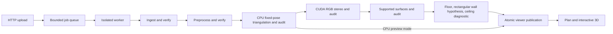

# Automatic reconstruction in Holo

Upload a complete Sensor Recorder ARKit export in **Input & validation**, leave **Reconstruct automatically** checked, and select **Process & reconstruct**. With the GPU runtime, one persisted job verifies ingestion, prepares views, triangulates fixed-camera features, reconstructs dense RGB stereo, extracts supported planes, estimates floor/walls/ceiling and publishes a rough floor plan plus interactive 3D. The CPU runtime produces an explicitly labelled sparse preview. **Open plan & interactive 3D** opens that exact capture. The catalog refreshes every five seconds and retains historical results.

For an ingestion-only Sensor Recorder capture, **Prepare & reconstruct** creates a child that reconstructs automatically after preprocessing. The preprocessing API also accepts `automatic_reconstruction=false` for preparation alone.

For an existing prepared capture, select it in history and use **Reconstruct room**. This creates a separate child run with owned copies of the audited input. Repeated requests for an in-flight child return the same job. **Retry reconstruction** is available when verified preprocessing survives a later failure. No historical capture is automatically rerun on startup.

## Runtime

For the full automatic dense workflow on this Windows/NVIDIA machine:

```shell
docker compose -f compose.yaml -f compose.reconstruction.yaml -f compose.gpu.yaml up --build --detach --wait
```

`compose.gpu.yaml` selects `gpu-app`, reserves one NVIDIA GPU and sets `RECONSTRUCTION_MODE=dense`. It needs Docker GPU support and the pinned Linux CUDA PyCOLMAP wheel, already cached on the development machine. The [Docker GPU reservation contract](https://docs.docker.com/compose/how-tos/gpu-support/) requires GPU capabilities. No Docker socket is mounted into the app. On supported native Linux, install `web` + `dense` extras instead of `reconstruct`. Native Windows can use the official pinned CUDA executable alongside CPU PyCOLMAP for the same dense workflow; see [native dense setup](NATIVE_DENSE.md). CPU-only installations retain sparse previews.

Modes: `auto` chooses dense when a usable CUDA backend/device is available, otherwise a sparse preview; `dense` requires CUDA and fails visibly if unavailable; `preview` explicitly chooses sparse. Health reports backend, capability, unavailable reason and configured mode. New uploads and `POST /api/jobs/{id}/reconstruct` accept multipart `reconstruction_mode=auto|dense|preview`; Holo exposes the quality selector before upload. Explicit dense upload is rejected before creating a job when unavailable. Existing sparse captures expose **Generate dense reconstruction** when CUDA is available. A fresh child preserves the previous result and input. Capture results and the reconstruction workspace summarize quality, provisional dimensions and ceiling height; a sparse preview reports ceiling height unavailable.

Docker's normal app image includes FFmpeg, the UI and pinned CPU PyCOLMAP 4.2.1; no GPU is required:

```shell
docker compose up --build --detach --wait
```

To retain the separately published dense/furnished example alongside new automatic captures:

```shell
docker compose -f compose.yaml -f compose.reconstruction.yaml up --build --detach --wait
```

Native development remains supported:

```shell
uv sync --locked --extra web --extra reconstruct
uv run --locked --extra web --extra reconstruct cozmo-web --reload
```

Run `npm run dev` in `frontend` for Vite, or build the frontend and run the server without reload. FFmpeg/FFprobe must be on PATH or specified with `--ffmpeg`. The `web` extra alone supports ingestion/preprocessing but lacks the reconstruction backend. Keep both extras on later uv commands. The CPU `reconstruct` extra conflicts with the separately isolated CUDA `dense` extra.

## Ownership and state



- `cozmo_web/automatic.py` orchestrates domain calls, selects views, admits retries and publishes the catalog entry. Geometry runs in the existing isolated worker, never in HTTP handlers.
- `cozmo_reconstruction/pipeline.py` owns SIFT/matching/fixed-camera triangulation, accepted multi-view points and independent source/geometry audits.
- `cozmo_reconstruction/dense` owns bounded CUDA PatchMatch and independent multi-view consistency; `surfaces` owns plane fitting and support diagnostics.
- `cozmo_reconstruction/viewer/dense_automatic.py` selects a provisional supported floor, reuses wall-candidate completion and independent ceiling estimation, then publishes after full-chain rechecks. `viewer/automatic.py` shares atomic encoding and retains the explicit sparse preview. Neither imports another capture's human annotations.
- `cozmo_web/reconstruction.py` combines optional historical assets with generated assets and serves only allowlisted, hash-checked files.

Progress states additionally include `DENSE_RECONSTRUCTING`, `EXTRACTING_SURFACES` and `ESTIMATING_ROOM` between sparse reconstruction and publication. Failure records include the stopped stage. Dense failures do not silently publish sparse success. Restart marks an interrupted run failed; untouched queued jobs resume. Verified bundle/preprocessing survives later-stage failures for downloads and fresh retries.

Workers remain serialized, with four waiting jobs by default. Automatic/reconstruction jobs default to a **3,600-second total deadline** (`RECONSTRUCTION_TIMEOUT_SECONDS`); ingestion-only jobs retain 600 seconds. Sparse work is bounded to 900 seconds and dense worker to 1,800 seconds. Shutdown terminates the process tree. Dense admission requires 4 GiB free working storage; this is an admission threshold, not a guarantee for every capture. Completed/failed data is retained.

## Geometry policy and limits

The automatic path currently accepts **Sensor Recorder ARKit exports**. Provided Stray-style inputs are still ingested and verified, with an explicit automatic-processing skip reason. Supporting their geometry requires exporter/convention work and is not silently inferred.

Up to **100** deterministically spread prepared views with normal tracking enter sparse processing. The opening RGB views remain eligible: excluding the first five seconds lost useful floor/doorway coverage. Object dimensions are still excluded. Dense processing prunes the accepted-track neighbor graph until every retained view has at least two retained neighbors; excluded ranks and the sparse manifest hash are recorded in `dense-selection.json`. All raw/prepared observations remain retained. Source K/poses stay fixed; native IMU is diagnostic only, without new VIO. LiDAR, reference dimensions/photo, measured ceiling, evaluation annotations and human furniture reviews do not enter geometry. The method follows [COLMAP known-camera reconstruction](https://colmap.github.io/faq.html#reconstruct-sparse-dense-model-from-known-camera-poses).

Accepted points pass the existing three-view track, reprojection and triangulation-angle gates. Sparse diagnostics remain in `boundary-report.json` and the downloadable model. Publishing an audited preview does not certify complete architectural coverage. Fewer than 100 finite accepted points or degenerate/narrow coverage stops publication with a support failure.

Dense plans use the lowest broad multiview horizontal plane below the cameras as an **unconfirmed floor candidate** (camera height 0.3–2.5 m, both patch spans at least 1 m). Supported vertical-plane intervals drive the existing rectangular completion. Furniture/corridors can bias this single-room prior. Ceiling uses the spatially balanced robust upper envelope of dense geometry, without the user's height reference; it remains provisional until a ceiling plane is verified. Door position follows the camera path; width/swing are illustrative. Human furniture labels are not transferred. CPU previews retain lower-quantile floor/PCA coverage envelopes and do not estimate ceiling.

Display uses rigid floor coordinates without changing source scale. Dense results retain the full cloud and display at most 120,000 deterministic points; only CPU previews apply the 0.5% per-axis display trim. Plan and 3D Top share orientation. Dimensions remain unverified; automatic hypotheses and reviewed/furnished examples remain distinct artifacts. Further Gaussian work stays deferred.

## Storage and verification

Each job owns raw, canonical, prepared, sparse, and (for full processing) `dense/`, `surfaces/`, `viewer/`, results and logs under `DATA_ROOT/jobs/<id>`. Atomic viewer publication uses `capture-<job-id>` under writable `DATA_ROOT/reconstructions`. Historical `RECONSTRUCTION_ROOT` remains optional/read-only.

The manifest signs nine portable assets and binds sparse or dense/surface manifests as appropriate. Report/download endpoints re-audit source values and every published upstream stage. Archives include raw, canonical, prepared, sparse, dense/surface outputs where available, and viewer assets. Each served asset is hash-checked. Existing source captures/viewers are preserved.

## Historical sparse baseline and regression: 2026-10-04

The real single-room input completed through HTTP upload and all automatic stages on Docker/Linux and native Windows without manual publication. Docker retained **9,169 accepted points**, displayed **8,903**, selected **80 views**, and produced an approximate **3.70 × 2.41 m coverage envelope**. Native displayed **8,834 points** and completed in about **112 seconds** on this machine. Cross-platform point equality is not claimed.

All ten historical Holo jobs retained their exact records. The downloaded Docker archive passed ZIP CRC, all nine viewer asset hashes matched API responses, and original uploaded video/sidecars retained their byte hashes. **136 automated cases pass on Windows/Linux**. Automatic tests additionally cover stage ordering/failure gating, unsupported-format skipping, retry admission/idempotency, restart failure persistence, sparse coordinate invariants, insufficient support and asset tampering. Evidence lives in ignored `outputs/automatic-evidence` and `outputs/automatic-*.log`.


## Dense correction: executed 2026-10-04

The sparse baseline above was a quality regression from the earlier dense room result. The correction reuses dense/surface/ceiling methods, without forcing the historical dimensions. Applying the automatic estimator to preserved dense data gives 3.15 × 4.10 m / 2.54 m. A **fresh GPU child** from the verified prepared capture (`f02743deab6c46a3b93bf70dcb23ec16`) completed in about **809 seconds**: 100 sparse views, 99 stereo-supported views, 846,791 source voxels / 120,000 display points, rough **3.33 × 3.85 m** / provisional **2.57 m** ceiling. Rank 1755 lacked accepted-track neighbors and was excluded only from stereo. Floor candidate P08 remains semantically unconfirmed; entrance follows the path on W4. The ceiling estimator did not consume the user's measured height; physical accuracy is unverified.

**143 tests pass on Windows/Linux**, including dense admission/failure handling, supported-view pruning, floor/table ambiguity, missing-floor refusal and retry verification retention. Frontend build/format and Ruff pass. Ignored `outputs/automatic-dense-evidence` holds preserved/fresh comparisons, asset/history/source checks and UI proof; logs are `outputs/automatic-dense-*.log`. The wheel/source package includes the new modules and GPU override, without raw captures, outputs or caches. No Gaussian training/downloads occurred.

The full fresh dense archive (2,046,324,256 bytes) passed CRC; all nine viewer/API hashes, eight raw file hashes, 43 historical viewer files and ten historical job records match. Report/download access passed full-chain re-auditing. Dense bundles can take minutes to prepare because these audits recompute consistency and evidence. The earlier failed dense child also retains an audited prepared-input download. Initial 3D camera framing now follows the inferred room rather than distant source outliers; source points remain retained.

Tab selection now stays synchronized with URL hashes, including reopening the same capture from Input & validation. Browser verification covers result-link navigation, Top/Front/Reset, estimated-height slicing and zero console errors.
