# Three input modalities: ingestion plan

Status: **cards 1–3 and 5 IMPLEMENTED; card 4 DROPPED; card 6 PLANNED**. Updated 2026-10-04. This document covers input acceptance, verification, canonical storage and Holo handoff. It does not authorize new preprocessing, photo scale estimation, LiDAR fusion, reconstruction, installations or model downloads. Existing video reconstruction stays operational. Tasks below are sized for sequential implementation by a smaller coding model.

Implementation note (2026-10-04): card 1 (v2 foundation/legacy bridge), card 2 (Photos CLI), card 3 (Photos in Holo) and card 5 (LiDAR CLI admission) are delivered. Photo ingestion lives in `cozmo_ingestion.multimodal` with `cozmo-ingest --mode photos`/`cozmo-verify`; Holo adds mode selection (Photos / Videos + intrinsics / Lidar), room/folder/ZIP upload, EXIF evidence, optional declared reference, portable download and a photos result view. Card 5 adds `cozmo-ingest --mode lidar` for the inspected Stray-style raw-depth layout: raw `uint16` depth and optional `uint8` confidence are retained with explicit `FORMAT_REFERENCE_ASSUMED` convention provenance, per-frame supplied K/poses populate `calibration.jsonl`/`poses.jsonl`, and geometry readiness stays `CONVENTIONS_UNVERIFIED`. Card 4 (plain no-tracking video) was **dropped** by user direction; Holo's "Videos + intrinsics" mode remains the ARKit export. The image inspector is standard-library only (no Pillow extra added or locked). Cards 6 remain NOT_RUN. Measured results are recorded in [context progress](../context/progress.md) and [material history](../context/logs.md).

## Requirements and inspected evidence

The [case-study PDF](../context/references/Applied_AI_Case_Study.pdf), physical page 2 (printed page 1), specifies three tiers: 2–8 photos per room without depth or poses; a handheld video walkthrough; and LiDAR depth with poses and intrinsics. Photo folders must preserve room membership for later whole-property stitching. iPhone 15 and above is the evaluation target; LiDAR needs supported Pro hardware. Ingestion success alone does not meet the subsequent reconstruction/accuracy gates on physical pages 2–4. The evaluator's separately published output JSON schema is still unavailable; our ingestion schema is internal.

Current `canonical-capture-1` accepts inspected Sensor Recorder Pro exports and supplied Stray-style exports. `pipeline.py` requires `wide.mp4` or `rgb.mp4`; `SourceCapture.origin`, adapter association, annotations and `CaptureReader` assume a timed camera stream. A photo adapter plugged into that interface would be insufficient. Supplied depth/confidence are currently retained and hash-checked but excluded from assisted RGB processing. [Current supplied-data contract](SUPPLIED_DATA.md).

### First photo fixture: `test_data/Room-1`

Read-only inspection found eight distinct JPEGs, each stored at 4000 × 3000 with EXIF orientation 6. All must be retained:

| File | Observed content / proposed role |
|---|---|
| `20261004_124156.jpg` | Notebook close-up on floor; reference candidate |
| `20261004_124159.jpg` | Wider room view containing the notebook; scene observation and reference candidate |
| `20261004_124201.jpg` | Cupboard/bed wall; scene observation |
| `20261004_124204.jpg` | Bed, wall and upper room; scene observation |
| `20261004_124206.jpg` | Door/window and furnishings; scene observation |
| `20261004_124213.jpg` | Door/window/AC; scene observation |
| `20261004_124220.jpg` | Wardrobe; scene observation |
| `20261004_124226.jpg` | Wardrobe/door/cupboard, notebook visible; scene observation and reference candidate |

These are assistant visual observations, not accepted object masks or correspondence measurements. The close-up remains one of the eight scene assets; an optional attachment of the same image is an alias to that asset, not a ninth scene image.

User declares the reference notebook/page is **0.21 × 0.297 m**. Record `USER_DECLARED` dimensions, `NOT_LOCALIZED` geometry and `NOT_APPLIED` scale. Do not transfer video corner marks, pose estimates, room dimensions, ceiling measurements or object thickness into this photo capture. Matching the notebook across images, localizing its corners and using its size are later preprocessing/reconstruction tasks. Its visibility in wider views is a potential bridge from detail to room geometry, not proof of recoverable metric scale.

EXIF reports Samsung Galaxy S24, 5.4 mm focal length, 23 mm equivalent and +05:30 timezone. Accept this as a device-agnostic ingestion fixture and label it separately from an iPhone benchmark. EXIF focal length does not provide a complete calibrated K matrix. Filename `124206` differs from EXIF time `12:42:05`; preserve both and their provenance. EXIF time is capture metadata, not a synchronized sensor clock or known camera pose.

Inspection evidence is local and ignored: `outputs/modality-planning/photos-inventory.json` and `photos-contact-sheet.jpg`. The close-up SHA-256 is `aa7957e7e253e5eca12cd591c8f3fd59e68c9344cc75ec14ebe6f9b5c7676d5d`. Implementation must regenerate inventory from the source folder, not depend on these developer outputs.

## Shared flow and ownership

```mermaid
flowchart LR
    A[Video / photo folders / LiDAR export] --> B[Bounded upload and source inventory]
    B --> C[Explicit modality and format selection]
    C --> D[Modality adapter and media inspectors]
    D --> E[Canonical observations and evidence ledger]
    E --> F[Independent verification and source hash recheck]
    F --> G[Atomic publication and portable download]
    G --> H[Capability-based downstream handoff]
```



Adapters parse source formats; inspectors decode and validate media; association services bind native IDs/timestamps using documented rules. The application service coordinates these components. Writers publish data; independent verifiers recompute structural/source checks. A router selects composition rather than a giant adapter class with video/photo/LiDAR conditionals.

Reuse path/archive guards, byte and pixel limits, hashing, staging, atomic publication, persistent jobs and portable downloads. Preserve originals, including EXIF, sensor rows, depth encoding and unattached assets. Input verification does not rotate/re-encode source images, resize depth, refine poses or apply scale. Derived thumbnails may be display-oriented but must record their transform and source hash.

## Modality contracts

| Mode | Required source | Optional evidence | Missing-data behavior |
|---|---|---|---|
| Video | One decodable walkthrough, or a supported complete recorder export | Camera K/poses, IMU, tracking, reference metadata/image | Ordinary video is valid RGB input; K/poses/IMU remain absent, not invented |
| Photos | Decodable still images grouped by room | EXIF, reference dimensions/image, room labels and declared connections | No depth/poses required; clock/K/world frame may be unknown |
| LiDAR | Versioned raw depth export with corresponding camera poses and intrinsics | RGB, confidence, IMU, tracking, distortion metadata | Unknown units/registration/conventions prevent reconstruction readiness; retained assets and findings remain available |

Use top-level mode `video | photos | lidar` and a separate source-format ID. A Stray export containing depth can still be selected as video: depth remains excluded in that profile. Selecting LiDAR requires the dedicated depth admission rules. Detection suggests formats but never turns arbitrary PNG folders into depth measurements. Conflicting selection/layout produces a clear error.

Photo transport accepts a single room folder, multiple per-room folders or a ZIP preserving them. Loose selected files become one explicitly named room. A property manifest is optional: generate stable room IDs from preserved paths when absent. Folder names/order do not establish physical adjacency. Optional declared connections are tagged `USER_DECLARED`; they are not measured topology. A continuous multi-room video may have room membership `UNSEGMENTED` until a later stage.

For the case-study photo profile, report 2–8 scene images per room. Count the notebook photo in this fixture. Ingestion can retain other counts with an `OUTSIDE_PHOTO_PROFILE` finding rather than silently dropping assets; downstream feasibility is separate. Additional reference-only attachments do not count as scene images unless the user explicitly assigns that role. Duplicate bytes retain all original paths but share an asset identity and do not inflate the distinct-photo count.

First image codec release: JPEG/PNG, validated by content and full decode rather than filename alone. HEIC/HEIF is a known phone-format gap: show an actionable unsupported-format response and document JPEG export. Add a tested optional decoder before claiming acceptance of default iPhone HEIC exports. Do not silently convert source files. Missing EXIF is acceptable. Corruption, unsafe paths or resource-limit violations fail admission with named findings.

### LiDAR adapter admission

Start with the supplied Stray-style single-room export, then the floor-only and with-ceiling captures. The [exporter's data specification](https://raw.githubusercontent.com/strayrobots/scanner/main/docs/format.md) describes uint16 depth in millimetres, uint8 confidence levels 0–2, and per-frame intrinsics in odometry; its final-frame camera matrix is a legacy fallback. Bind those claims to a versioned adapter and recorded evidence, not a universal rule for PNG files. Local frame `000000` inspection confirms 256 × 192 uint16 depth and same-grid uint8 confidence; value ranges alone cannot establish units.

Each depth observation must record native frame ID, asset hash, dimensions/type/encoding, units and conversion factor, invalid-value semantics, depth definition (optical-axis depth versus range), pixel-grid orientation and confidence meaning if supplied. Record pose direction, quaternion ordering, axes, translation units, world-frame identity and convention provenance. Supplied Stray optical-camera conversion must not receive a second ARKit axis flip.

Associate depth, RGB, K and pose by native IDs plus evidenced clock mapping. Existing supplied RGB startup discards mean decoded rank 0 maps to native ID 1; retain native depth/pose ID 0 as unassociated rather than forcing it onto RGB rank 0. Missing confidence is an explicit absent capability; bad confidence shape or categories is a validation finding. Do not guess frame offsets on a new exporter.

Record K's reference grid and any RGB-to-depth registration/extrinsics. A documented same-camera pixel-grid scaling can yield derived depth K with recorded transforms; otherwise calibration stays unresolved. Store raw versus temporally smoothed depth semantics when available. Do not upsample depth into RGB during ingestion. Preserve IMU units as unresolved where exporter documentation and source conventions disagree; IMU is optional for LiDAR admission.

Unknown exporter version or conventions can pass byte integrity but must remain `CONVENTIONS_UNVERIFIED`; geometry readiness requires a tested format rule and resolved essential depth/pose/K semantics. A PLY/OBJ or finished RoomPlan mesh alone is not the raw-depth tier contract. Such assets can be retained as supplemental material, not substituted for sensor observations. The future real-phone capture protocol must name an app/version whose actual export satisfies this contract; the supplied layout is presently a development fixture.

## Canonical schema and compatibility

Introduce **`canonical-capture-2` for new modalities**, while retaining existing v1 video writing, reading, verification and automatic jobs. Do not rewrite old bundles or invalidate their hashes. A new version-dispatching catalog reader exposes modality/capabilities; it delegates v1 to the existing reader and admits v2 only through its own validator. Existing preprocessing continues using its strict v1 profile until a specific v2 consumer is implemented.

The v2 layout is proposed as:

```text
manifest.json          # schema, IDs, modality, adapter/version, capabilities, provenance
rooms.json             # property membership; optional declared connections
assets.json            # original paths, SHA-256, bytes, media roles and native dimensions
observations.jsonl     # asset/frame references; nullable clock, K and pose references
associations.jsonl     # matched/unmatched source IDs; rule, residual and evidence
calibration.jsonl      # only actual supplied calibration; empty is valid for photos
poses.jsonl            # only actual supplied poses; empty is valid for photos
references.json        # user reference objects/assets/dimensions; scale not applied
verification.json      # integrity, format/profile readiness and downstream capability gates
sources/               # portable originals, streamed into download archives
```

Publish an internal JSON Schema and verifier covering types, finite values, unique IDs, referential integrity and safe paths. Optional calibration/pose references are null when absent; distinguish absence from present-but-unverified values. Capabilities include evidence status, not just booleans: `ABSENT`, `PRESENT_UNVERIFIED`, `VERIFIED_FORMAT`. Format verification never claims physical accuracy. Keep ingestion integrity, tier profile, consumer readiness and metric accuracy as separate report fields.

An observation references its source asset and room ID, native frame/image ID, pixel grid, optional timestamp with domain/timezone/source, optional K/pose IDs and processing eligibility. Still photos have no invented FPS, sensor time, video frame index or camera trajectory. Canonical serialization is deterministic for equivalent source/adapter/declarations. Record source identity separately from declaration/configuration identity; changing a role or dimension creates a new derived job revision without changing the raw source hash.

Reference metadata binds to capture/asset SHA rather than the currently required video SHA. For this fixture, propose object `a4-reference-1`, width 0.21 m, height 0.297 m, the close-up asset and wider-view candidate asset IDs, dimension provenance `USER_DECLARED`, corners null, scale `NOT_APPLIED`. Object identity across candidates remains a reviewable association. If corners are added later, require ordered dimensions and an explicit native/display pixel-grid transform. Reference images remain optional for all modes. Unassisted and reference-assisted benchmark runs must be labelled separately.

## Holo and execution design

Add **Video / Photos / LiDAR** choices inside Input & validation, not three extra application tabs. Each displays its required files. Photos show room groups, eight thumbnails for this fixture, optional reference-image selection/upload and width/height units. Selecting an existing image as reference must reuse its asset; allow multiple roles. LiDAR displays matched/unmatched stream counts, unresolved conventions and confidence availability. Generic history/downloads show mode, rooms, verification and next-stage status.

API request adds explicit modality and optional declarations; omitted modality keeps the current legacy-video behavior. Upload session state preserves room paths and mode, and cannot mix unrelated exports. Worker handoff uses a registry keyed by schema, adapter and verified capabilities. New photo, plain-video and LiDAR routes initially end at verified ingestion with `NOT_IMPLEMENTED_FOR_MODALITY` for preprocessing/reconstruction. Do not feed them into the existing fixed-ARKit-pose dense worker or mark a skipped reconstruction as completed geometry.

Support CLI, native `uv`/venv and Docker with identical schema, verification and error behavior. Add an optional image-inspection extra (Pillow) and include it in web installations; resolve/test it in `uv.lock` during implementation. No CUDA or learned model is required for ingestion. Update Docker/source-distribution contents and capture protocols as part of shipping each mode. Use streaming source hashes and bounded per-image depth decoding rather than loading all maps into memory.

### Proposed modules and existing touchpoints

| Location | Responsibility |
|---|---|
| `src/cozmo_ingestion/multimodal/contracts.py` | Immutable v2 request, assets, observations, rooms, capabilities and findings |
| `multimodal/router.py`, `pipeline.py` | Explicit dispatch and shared transaction coordination |
| `multimodal/adapters/photos.py` | Per-room still inventory and EXIF evidence |
| `multimodal/adapters/plain_video.py` | RGB-only clip contract using the existing FFmpeg inspector |
| `multimodal/adapters/stray_lidar.py` | Versioned depth/pose/K source parsing and association |
| `multimodal/media.py` | Image/depth inspectors behind narrow protocols |
| `multimodal/bundle.py`, `verify.py`, `reader.py` | Deterministic v2 writing, independent validation and catalog dispatch |
| Existing `cli.py`, `reader.py` | CLI mode selection and minimal compatibility seam; preserve v1 behavior |
| `src/cozmo_web/uploads.py`, `reference_images.py`, `worker.py` | Transport grouping, generic reference binding and safe capability handoff |
| `frontend/src/features/ingestion/Input.tsx`, `frontend/src/api/client.ts` | Mode controls, typed room/reference forms and reports |

Names are implementation targets, not files already delivered. Prefer composition and injected inspectors/writers to inheritance. Keep exporter-specific conventions out of HTTP routes and UI components.

## Sequential implementation cards

1. **V2 foundation and legacy bridge.** Add contracts, internal schema, catalog dispatch, atomic writer/verifier and mode field. Prove v1 reader/CLI/history/reconstruction regression checks still pass. Test null K/poses, invalid links, unknown schema, source mutation, path/ZIP/resource guards and deterministic manifests. No media processing or reconstruction changes.
2. **Photos CLI first.** Add JPEG/PNG decode/EXIF inspection, rooms and reference binding. Run `test_data/Room-1` read-only: exactly eight distinct assets, preserved source hashes, 4000 × 3000 native grids, recorded orientation 6, unknown camera K/poses, optional 0.21 × 0.297 m declaration with no scale correction. Verify again from a portable extracted bundle. Test no EXIF, corrupt images, duplicate aliases, date discrepancies and out-of-profile counts. A separate synthetic multi-room fixture tests membership without pretending to prove stitching.
3. **Photos in Holo.** Add mode selection, room uploads, reference selection/attachment, history and portable download. Verify native and Docker upload of the real eight-photo folder; all source hashes match the CLI. Confirm legacy video uploads still auto-reconstruct and photo jobs stop honestly after ingestion. Document JPEG handoff and HEIC gap.
4. **Plain video admission.** Keep complete recorder exports unchanged; add RGB-only clip inspection and v2 publication. Test absent K/poses/IMU, rotation and variable timestamps without fabricating calibration. Holo ends at ingestion until the later RGB-only preprocessing consumer exists. This closes the current ingestion gap for the PDF's ordinary video tier.
5. **LiDAR CLI admission.** Add the inspected Stray-style raw-depth variant with explicit convention provenance and depth profile. Verify complete streams, native-ID alignment, initial unassociated frame, K grids, pose axes, invalid samples and optional confidence. Tests must catch units ambiguity, swapped pose direction, double axis flip, missing maps and mismatched grids. Recheck all three supplied fixtures without altering their existing v1 bundles or enabling depth in the video profile.
6. **LiDAR Holo and shipping audit.** Add stream/readiness UI, portable replay, CPU native/Docker verification, protocol/device matrix and optional dependency/package checks. Before claiming live-phone LiDAR support, obtain and validate one versioned real export from the selected capture tool. Keep unknown exporter metadata visible. Reconstruction remains subsequent work.

For each card: run its meaningful focused tests, the affected existing regression suite, Ruff and relevant frontend build checks; add native/Docker real-data checks only when that boundary changes. Record measured results and limitations, not expected numbers. Source inputs/history must remain byte-preserved. Commit boundaries may follow cards when the user requests implementation/commits; this planning turn makes no commit.

Suggested handoff prompt: “Implement card 1 from INPUT_MODALITIES_PLAN.md, then card 2. Keep v1 and automatic video reconstruction compatible. Do not implement photo calibration/reconstruction or LiDAR fusion. Use the eight Room-1 JPEGs as read-only input and prove source preservation and portable verification. Report actual tests and remaining gaps before proceeding to Holo.”

## Following ingestion

Photos need image quality/overlap checks, camera estimation and reconstruction robust to sparse views. Optional A4 localization can later constrain/check metric scale if it connects to scene geometry; a close-up's size-to-pixel ratio alone cannot measure the room. Per-room reconstruction and cross-room matching/adjacency remain later tasks. LiDAR needs calibrated depth unprojection, confidence filtering and pose-aware fusion. All tiers eventually need honest uncertainty, benchmark comparisons and the same property-level outputs. None of those algorithms is implemented or verified by this ingestion plan.
