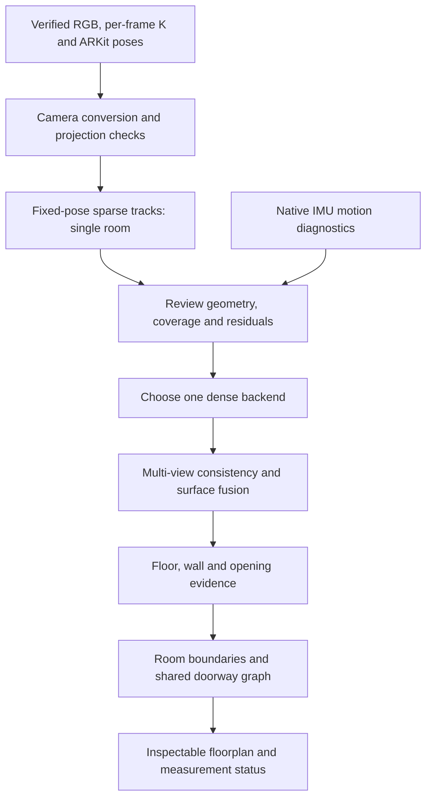

# First iOS reconstruction trial

Update 2026-10-04: [CPU surface evidence](SURFACES.md) is implemented after dense reconstruction. Twelve planes are proposed, with eight multi-view candidates and explicit furniture/ambiguity flags; RGB review identifies the largest horizontal candidate as a bed. Confirmed architectural surfaces and floorplan remain absent. The research sequence below is historical; structural proposals are now executed, while reviewed identities, wall boundaries and room stitching remain next.

Plan prepared 2026-10-03 after the [preprocessing review](../ingestion/PREPROCESSING_REVIEW.md), then implemented after the user's "go ahead". Sparse 24/100-view trials are verified; [dense RGB stereo](DENSE_RECONSTRUCTION.md) now has verified 18/100-view GPU trials and an offline six-view learned comparison. Current engineering baseline is fixed-pose COLMAP stereo, with incomplete architecture and unverified physical accuracy. Double-room reconstruction, structural extraction, mesh/TSDF and Holo reconstruction integration remain future milestones. The following research sequence preserves earlier reasoning; it does not certify a final submission stack.

Research refreshed on 2026-10-03 at the user's request before implementation. Rechecked official COLMAP/PyCOLMAP, MapAnything and DA3 documentation and researched Open3D fusion/plane extraction. A read-only local GPU query still reports RTX 4060 Laptop GPU, 8,188 MiB VRAM and driver 610.74; this does not verify CUDA in Python or Docker. Prior preprocessing review numbers below are retained evidence, not newly rerun tests.

## Approach from prepared frames to a floorplan

The immediate question is whether the supplied cameras and image correspondences produce coherent 3D evidence. The eventual objective is architectural surfaces and a stitched floorplan. Keep those milestones separate so a successful feature matcher or attractive mesh cannot be mistaken for a measured room.

| Milestone | Deliverable | Decision before expanding |
|---|---|---|
| Camera adapter | Source-bound images/cameras and analytic projection checks | IDs, grid, transforms and fixed source scale agree |
| Sparse single room | PLY, camera trajectory, image-linked tracks and residual report | Useful parallax/architectural support; investigate unexplained failures |
| Dense single room | Depth maps, validity masks and fused surface preview | Cross-view consistency and wall/floor coverage, rather than just point count |
| Two-room geometry | One-world cloud and doorway-transition evidence | Shared surfaces/tracks connect rooms; source event remains visible in diagnostics |
| Structural extraction | Supported planes, wall segments, room polygons and candidate openings | Furniture/occlusion and missing boundaries explicitly represented |
| Product integration | Separate Holo reconstruction jobs, previews, reports and exports | Native and Docker reproducibility and auditable outputs |

The sparse trial is our diagnostic control, not a universal prerequisite imposed by COLMAP. Upstream also documents dense reconstruction directly from known cameras with explicit source images and depth bounds. A sparse failure caused by blank walls does not automatically reject posed dense reconstruction; a conversion or pose inconsistency must be resolved or explicitly bounded before trusting fused geometry. [Known-camera workflow](https://colmap.github.io/faq.html#reconstruct-sparse-dense-model-from-known-camera-poses).

## Dense reconstruction decision and structural follow-up

Choose **one** dense route after the sparse control. First probe the reconstruction runtime for CUDA support and measured memory use. If a compatible COLMAP CUDA runtime works, test a small overlapping set using PatchMatch depth and stereo fusion. Its ordinary PyCOLMAP wheel does not provide a demonstrated dense CUDA path; official CUDA wheels are currently Linux-only. Keep GPU setup bounded and retain the native CPU sparse route. [PyCOLMAP installation](https://colmap.github.io/pycolmap/index.html), [CUDA requirement](https://pypi.org/project/pycolmap/4.2.1/).

If conventional stereo lacks wall coverage or CUDA setup fails, compare a small pose-conditioned learned-depth run. Inspect the already pinned MapAnything baseline first to avoid an unnecessary new checkpoint, while recognizing its earlier incomplete geometry. DA3 is an alternative only if its API/runtime/checkpoint trial offers a concrete advantage. Neither candidate is selected as the final dense backend yet. Record any resize/crop and transformed K, depth convention (optical z versus range), input camera conditioning, validity masks, model/version and source-world alignment. Check projected depth against other views and sparse tracks; model confidence is not calibrated measurement uncertainty.

Back-project accepted depths into the unchanged source world and compare overlapping surfaces before fusion. Mask invalid depth and moving objects; preserve rejected-observation counts. Start with an inspectable point cloud. Consider TSDF integration only when depth units, projection and cross-view consistency are established. Open3D provides RGB/depth integration using camera calibration and extrinsics; its example uses inverse camera-to-world poses. This would consume our RGB-derived depth, never the excluded capture LiDAR. Avoid forcing a watertight mesh across unobserved areas. [Open3D integration](https://www.open3d.org/docs/release/tutorial/pipelines/rgbd_integration.html).

Structural extraction is a subsequent stage: check the source gravity/world-axis declaration, fit supported horizontal floor/ceiling and vertical wall candidates, project wall extents to the floor plane and assemble room boundaries. Robust plane fitting is available in Open3D; distinguishing a wardrobe from a wall additionally needs spatial/image evidence. Orthogonal/Manhattan assumptions should be optional and recorded. An empty cloud region may be an occlusion, not a door: require image/depth evidence for openings. Maintain observed, inferred and unknown segments separately; do not close incomplete rooms simply to create a polygon. [Open3D plane segmentation](https://www.open3d.org/docs/release/tutorial/geometry/pointcloud.html#plane-segmentation).

The double-room trial retains the same source world throughout. Inspect cross-doorway evidence and the marked 40.548-second pose event before deriving room adjacency. Any later drift/pose optimization belongs to a separate, compared experiment with fixed gauge and before/after evidence; naive per-room ICP or independent rescaling could conceal the connection error. Derived dimensions initially have source-scale provenance and **accuracy UNVERIFIED**. Independent tape/laser references and repeated captures are needed before centimetre-accuracy or calibrated-interval claims.

## Delivery and portability sequence

Implement and exercise the CLI contract first, then add Holo integration once actual sparse outputs verify. Keep `reconstruct` optional under uv, separate backend orchestration from web routes and preserve the existing development path. Plan a CPU-capable Docker reconstruction worker; make any GPU configuration an explicit optional profile with its own capability probe, not a requirement for ingestion or preprocessing. Do not change queue timeouts based on guessed runtimes.

Within the assignment deadline, prioritize one reproduced single-room result, its failure/coverage report and then the two-room connection. Dense and floorplan stages are contingent on geometry evidence, not assumed achievements. The next implementation deliverable remains the 24-view/full-component sparse control described below. No dependency installation, inference, reconstruction run, application change or commit occurred in this research refresh.

## Recommended first backend

Use **COLMAP/PyCOLMAP 4.2.1 for fixed-pose sparse triangulation**. This separates image-supported geometry from learned dense-surface predictions and checks whether supplied iOS cameras are sufficiently consistent for useful tracks. Temporal matching must include revisits: review found 100/106 single-room and 210/240 double-room views in the largest image-support components, but stricter pose/parallax-related diagnostics remain fragmented.

COLMAP documents reconstruction from supplied camera models and poses. Its model uses optical world-to-camera transforms; our source stores optical camera-to-world, so the adapter must invert once and preserve image/calibration identities. Current documentation also defines a pixel-center offset relative to OpenCV. This conversion must be explicit; the source export's exact center convention is not yet verified. [Known-pose procedure and calibration conventions](https://colmap.github.io/faq.html#reconstruct-sparse-dense-model-from-known-camera-poses), [model format](https://colmap.github.io/format.html#images-txt).

Pin the stable **4.2.1** release, source `bd1fcf654d2dd8fefa1466999c190a246f83f4b9`, rather than copying mutable development defaults. [Release](https://github.com/colmap/colmap/releases/tag/4.2.1). PyPI publishes CPython 3.12 Windows x86-64 and Linux x86-64 wheels. The upstream package documents CPU-capable sparse operations, while PatchMatch dense stereo requires CUDA support; CUDA wheels are currently a separate Linux option. A Windows CPU wheel does not establish native/Docker dense-GPU availability. [PyCOLMAP 4.2.1 distribution and capabilities](https://pypi.org/project/pycolmap/4.2.1/).

At the research probe, prototype-2 had NumPy/OpenCV but no PyCOLMAP or Torch and no COLMAP command on PATH. Subsequent authorized implementation installed pinned PyCOLMAP 4.2.1 and executed CPU sparse trials; that wheel reports CUDA unavailable. No Torch/checkpoint/CUDA setup or dense run was added. The older prototype-1 environment/checkpoint is preserved separately.

## Candidate comparison

| Route | First role | Reason to use or defer |
|---|---|---|
| Fixed-pose COLMAP sparse | Recommended first control | Explicit geometric evidence, supplied-camera gauge, small optional CPU dependency; cannot recover untextured dense walls by itself |
| COLMAP dense MVS | After sparse/pose checks and a GPU capability probe | Known-camera stereo and fusion are documented; CUDA/runtime/VRAM and blank-surface completeness remain unverified here |
| Existing pinned MapAnything | Possible later RGB-derived dense comparison | Supports RGB/K/optical camera-to-world conditioning; prototype-1 already has a pinned CPU path, but earlier geometry was incomplete and this iOS adapter is unimplemented |
| DA3 pose-conditioned depth | Alternative dense experiment if needed | API accepts K/world-to-camera extrinsics and can align predicted depth to supplied-camera scale; new setup/checkpoint/runtime remain untested |
| Gaussian training / new inertial SLAM | Defer for this first trial | Additional optimization and runtime variables before the camera/track contract has been tested on these captures |

MapAnything's documented pose input is optical camera-to-world. DA3's `align_to_input_ext_scale` can replace predicted poses with input poses and rescale predicted depth; that is a model conditioning/alignment choice, not independent measurement validation. [MapAnything API/examples](https://github.com/facebookresearch/map-anything#inference), [DA3 API](https://github.com/ByteDance-Seed/Depth-Anything-3/blob/main/docs/API.md). Any later model depth/confidence must be labeled **RGB-derived predictions**, kept distinct from measured LiDAR and never populated from excluded capture files.

## Input and gauge contract

- Consume a fully verified preprocessing bundle through a new prepared-input reader. Admit selected native RGB, each frame's K and supplied pose; use native IMU intervals only for review diagnostics. Reject raw depth/confidence, reference dimensions/photo and evaluation geometry as reconstruction inputs.
- Source observation files remain immutable. Backend-specific camera records are derived conversions with their own manifest and mapping back to rank/frame/K/pose IDs.
- Keep source metre translations and world axes. Invert camera-to-world once; audit inverse/round-trip, camera center and projected optical directions on analytic fixtures. No second ARKit optical-axis flip, first-frame scale normalization, Umeyama scale fit or independent recentering of rooms.
- Retain per-frame K with distinct camera records when parameters differ. Begin with a **pinhole approximation explicitly marked distortion UNVERIFIED**, rather than inventing zero-distortion calibration evidence. Record the backend's pixel convention and any 0.5-pixel conversion. A documented synthetic projection test must check the implemented mapping; it does not physically calibrate the original phone.
- Keep poses and intrinsics fixed. Explicitly configure the pinned triangulation API instead of assuming defaults: disable intrinsic refinement and constrain existing frame/camera/rig transforms as applicable. Latest docs expose `triangulate_points`, `fix_existing_frames` and constant-camera options, but confirm the installed 4.2.1 API before implementation. Snapshot and compare every camera before/after; unexpected changes fail publication. [API reference](https://colmap.github.io/pycolmap/pycolmap.html#pycolmap.triangulate_points).

## Bounded execution sequence

1. **Install/import gate.** Add an optional `reconstruct` extra pinned to `pycolmap==4.2.1` using uv; review platform lockfile hashes. Keep ingestion dependencies minimal and existing web behavior runnable. Exercise CPU feature extraction/triangulation on analytic known-camera fixtures before real data. A missing wheel or API mismatch should produce a recorded limitation, not an automatic source-build/CUDA project.
2. **24-view smoke trial.** The proposed input uses selected ranks `270, 330, 390, 450, 510, 570, 645, 705, 765, 825, 885, 945, 1005, 1065, 1140, 1185, 1245, 1305, 1380, 1440, 1500, 1560, 1620, 1680`, approximately 4.5–28.0 seconds. These are time-spread members of the 100-view review component, not a guaranteed connected subset. Exhaustive matching is only 276 pairs. If sparse sampling loses overlap, report that and add selected neighboring views rather than infer capture failure. The machine-readable proposal remains [local evidence](../../outputs/preconstruction-review-v1/single-trial-input-proposal.json).
3. **Full single-room trial.** If conversions/source preservation work, use the 100-view component with temporal-window and revisit pairs, plus additional correspondences justified by the backend. Record six excluded ranks `855, 1695, 1710, 1725, 1740, 1755`; originals remain available. Start with native-grid features capped at 4,096 per image, deterministic recorded seed and four CPU threads. These are experiment limits, not tuned accuracy settings. Do not treat the 640-wide review's matches as ready-made multi-view tracks.
4. **Evaluate sparse geometry.** Triangulate tracks; inspect positive depth, track conflicts, triangulation angles, reprojection distribution, supported-image count and camera/point plots. Record disconnected or unsupported views. Evaluate doorway, floor and wall evidence separately from furniture point counts. Recheck source/bundle hashes and fixed-camera invariants before publication.
5. **Choose dense follow-up.** Only after camera/track results are interpretable, choose a bounded dense route: working CUDA MVS, or a small posed RGB-derived learned-depth comparison. Sparse output alone is insufficient to justify wall-plane extraction or floorplan accuracy. Do not start training multiple Gaussian/SLAM backends concurrently.
6. **Double-room extension.** After a useful single-room result, repeat with the double-room selection and explicit 40.548-second source event. Inspect cross-doorway tracks and connected geometry. Keep one source world; do not independently align rooms using an arbitrary scale. Compare marked event behavior without silently smoothing the trajectory.

Suggested limits: 15 minutes for wheel/import/API/fixture setup, 5 minutes for the 24-view smoke and 10 minutes for the full single-room sparse run, recording each timeout/failure. These are proposed caps, not measured runtimes. Use CLI first; preserve Holo's existing 600-second worker limit until measured integration evidence supports a change. Retry in new output folders.

## Proposed module and output design

A sibling `cozmo_reconstruction` package should own reconstruction, with no HTTP/frontend imports. Keep a typed immutable request/policy, a prepared-bundle reader, explicit camera converter, backend protocol and injected PyCOLMAP implementation, pipeline coordinator, report/verifier and CLI. Stateless transform/track checks remain functions; backend/process state belongs to objects. Verify source snapshots, stage derived artifacts and publish atomically, following the existing pipeline pattern. Reuse integrity/transaction utilities without putting reconstruction algorithms into ingestion.

First output contract: `manifest.json`, source-bound `input_mapping.json`, recorded backend options/tool versions, camera model and feature/track database, `cloud.ply`, camera trajectory, `report.json`, top-down/3D review artifacts and verification evidence. Sparse point lineage must identify contributing image IDs/keypoints and reprojection diagnostics. UI integration can later expose a distinct reconstruction child job using the existing worker/persistence model; the research does not add a new tab or alter the running app.

## Trial gates and limitations

Hard gates: permitted inputs only, valid/source-bound image identities, tested projection conventions, finite poses/K, source hashes unchanged, fixed cameras/scale retained, output integrity and explicit no-overwrite/failure behavior. These establish the adapter contract, not physical accuracy.

Proposed engineering signals for continuing: at least 70% of trial images supporting valid tracks, a largest track-connected component covering at least 70% of trial images, median reprojection at most 2 native pixels and p90 at most 4 pixels, predominantly positive-depth accepted observations and evidence in multiple architectural regions. Report counts/denominators and rejected tracks; thresholds are proposals that must not become an accuracy certificate. A homography-only component or many points on a desk/bed is insufficient. Low parallax, extreme depth or repeated textures need direct review even when residuals are small.

If the fixed-camera trial is poor, first separate convention errors, overlap/texture limits, distortion assumptions and pose inconsistency. Any pose-refinement experiment needs a separate gauge-preservation design and result rather than silently relaxing the baseline. Known-size object solving, IMU re-integration and LiDAR remain deferred.

The first deliverable, **inspectable sparse geometry and diagnostics**, is complete. Next proposed geometry milestone is a bounded dense single-room comparison followed by architectural review and the two-room connection. Independent wall/opening measurements are still absent; neither source ARKit metre scale nor low reprojection error demonstrates dimensional accuracy or assignment compliance.
