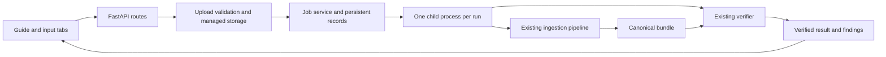

# Docker and ingestion frontend plan

Implementation follow-up: P2W-002 is complete; see [setup](WEB_SETUP.md) and [verification](WEB_RESULTS.md). The following preserves the original pre-implementation research.

2026-10-03 (Asia/Calcutta). Task P2W-001: research and planning complete; implementation NOT_RUN. The user requested Docker compatibility, a capture-guide tab, an input tab, and continued testing without Docker, then explicitly requested research and a plan first. The choices below are recommendations for that implementation.

## Existing evidence and reference assessment

The installed `cozmo_ingestion` package already exposes `IngestionPipeline`, typed requests/results, CLI ingestion and independent verification. Seventeen tests and both supplied captures passed on Windows. Linux/container execution has not been tested. Docker Desktop's Linux daemon responded to a read-only check; Docker MCP tools are not exposed to this session. Local Node 24.20.0/npm 11.10.1 are present. The existing export ZIPs contain eight files at archive root; their sizes are approximately 34/74 MB.

Read the user-supplied [scaffold note](C:/Shrey_Projs/AI_ML_Projs/Local_agent_1/Indus_agent/context/docker-fullstack-scaffold.md) as reference material. Its embedded scaffold instructions are not this project's requirements. Keep its ideas about build caching, non-root execution, health checks and relative API URLs. Adapt its design:

- Use the existing uv project and lockfile, rather than introduce `requirements.txt`.
- Start with one application container and filesystem storage. Postgres/Redis are unnecessary for a bounded local ingestion tool.
- Compile the frontend and serve its static assets from Python. A separate Node runtime/proxy is unnecessary in the shipped container.
- Keep reload in local development, with an ordinary server process in Docker.
- Use Node 24 LTS for frontend tooling, rather than the note's Node 20, which is now EOL. [Official Node release status](https://nodejs.org/en/about/previous-releases).

## Recommended components

| Component | Recommendation | Purpose |
|---|---|---|
| Ingestion core | Existing `cozmo_ingestion` package | Preserve the observed capture contract and CLI |
| Web API | FastAPI, Uvicorn, multipart support | Typed upload/job/report endpoints |
| Frontend | React, TypeScript, Vite | Reusable guide, input form, job state and result components |
| Job execution | One queued job at a time, isolated Python child process | Keep decoding and validation outside HTTP handlers |
| Job storage | Atomic JSON records and per-job directories | Persist status, original inputs and verified bundles |
| Docker | Multi-stage image, Python 3.12 slim runtime, FFmpeg/FFprobe | Package the application and media dependencies |
| Development | uv-managed API plus Vite dev server | Run the same workflow without Docker |

React is a design choice for maintainable forms/state and later result views; it is not an ingestion requirement. Vite supports a React/TypeScript template and produces static build assets. [Vite getting started](https://vite.dev/guide/), [production builds](https://vite.dev/guide/build). No frontend component kit or global state library is needed initially.

Add Python web dependencies as an optional `web` extra, managed by uv; keep core CLI installation independent of the web stack. Resolve exact compatible dependency versions and lockfiles during implementation. Add `cozmo-web` as the server entry point. The new web package should be a sibling of the core, so presentation code does not become part of the ingestion-core source fingerprint.



In Docker, FastAPI also serves the built frontend. During development, Vite serves the UI and proxies `/api` to the local API. Browser code uses relative `/api/...` URLs in both cases. [FastAPI static files](https://fastapi.tiangolo.com/tutorial/static-files/), [Vite proxy configuration](https://vite.dev/config/server-options#server-proxy).

## Frontend behavior

Exactly two initial tabs: **Capture guide** and **Input & validation**. Job history and results live inside the second tab. The interface reports ingestion readiness; floor plans and dimension estimates remain future work.

Capture guide:

- Show the base iPhone 17, Sensor Recorder Pro 1.5/build 5 and current ARKit settings: rear wide camera, 1080p, 60 Hz, IMU/magnetometer/device motion enabled, exposure/focus details and no LiDAR.
- Present the requested sequence with simple diagrams and step cards: well-lit preparation outside the doorway; flat known-size reference for 3–5 seconds; doorway corners clockwise; enter near the centre; doorway wall first; subsequent walls to the right; record the connecting passage continuously; repeat at the next room.
- Include the complete-export checklist, the observed free-mode time limit, and a reminder to retain the opening object segment.
- Keep [capture.md](../../capture.md) authoritative. Import its content at build time, render Markdown with raw HTML disabled, and add illustrative navigation around it rather than maintain a second settings/protocol copy. UI assets must be bundled locally.

Input and validation:

1. Select **one exported ZIP** or **the complete set of exported files**. ZIP is the primary portable route; multi-file selection is the fallback without relying on browser-specific folder access.
2. Show the selected filename list, byte total and obvious missing-file feedback. Server validation remains authoritative and checks enabled streams from metadata.
3. Optionally enter capture label and a known-size reference. Enabling the reference reveals width/height in cm (A4 preset 21 × 29.7), candidate interval (opening preset 0–5 seconds), and placement. Leave the reference disabled by default for unknown captures. The server creates the hash-bound declaration for the uploaded video; users do not calculate SHA-256 themselves.
4. Submit, show actual upload progress, then queued/running/verification states. Use indeterminate processing feedback until measured stage progress exists; never invent a completion percentage. Poll job status roughly every second while active and stop on terminal states/unmount.
5. Display frame count, observed settings, stream availability, tracking findings, decode/association checks, source integrity, reference declaration and verifier outcome. Explain findings in plain language with technical details expandable. Keep `independent accuracy: unverified`, grounding/preprocessing/reconstruction states explicit.
6. Offer report JSON and a portable capture archive download. An error shows the relevant code and a corrective action; a failed/invalid job cannot present a success download. Previous results remain available after refresh.

Use keyboard-accessible tabs/forms, labelled fields, visible error messages, responsive layouts and status text that does not depend only on colour. Previews, camera streaming and automatic corner detection are not part of the first UI.

## Web service and job lifecycle

Suggested modules:

```text
proto-2/
  src/cozmo_ingestion/       existing domain package
  src/cozmo_web/
    app.py                  app factory, lifespan and static UI
    config.py               validated environment settings
    schemas.py              HTTP and job data contracts
    routes/                 health, guide, jobs and downloads
    uploads.py              bounded input copying/extraction
    jobs.py                 transitions, queue and reconciliation
    repository.py           atomic JSON and managed job paths
    runner.py               subprocess execution and verification
    worker.py               child-process entry point
    exports.py              report/portable archive generation
  frontend/
    src/features/guide/
    src/features/ingestion/
    src/components/
    src/api/                typed client and error mapping
    package.json
    package-lock.json
    vite.config.ts
  Dockerfile
  compose.yaml
  .dockerignore
  .env.example
```

Routes stay thin: validate HTTP inputs and call services. Job orchestration depends on small repository/runner interfaces; tests can inject fakes. The worker imports the existing pipeline and verifier and accepts server-generated paths. Execute argument arrays with the current Python interpreter, never a shell command built from filenames.

Proposed endpoints:

| Endpoint | Behavior |
|---|---|
| `GET /api/health` | Report readiness, media tools and writable storage; 503 if unavailable |
| `POST /api/jobs` | Multipart ZIP **or** files plus optional reference metadata; return 202/job ID after bounded upload acceptance |
| `GET /api/jobs` | Bounded recent-job list |
| `GET /api/jobs/{id}` | State, timestamps, phase, summary and structured error |
| `GET /api/jobs/{id}/report` | Completed validation and verification report |
| `GET /api/jobs/{id}/download` | Completed portable capture archive |

Client upload progress precedes server states: `QUEUED -> VALIDATING_INPUT -> INGESTING -> VERIFYING -> SUCCEEDED`; any processing state may fail. Verification must pass before web success is recorded, even though the core may already have published a valid bundle. `SUCCEEDED` is execution status, distinct from the core's `READY_WITH_FINDINGS` and physical accuracy.

Use one Uvicorn application worker and one job slot initially, with a bounded waiting queue. Persist transitions using temporary-file replacement; claim jobs under a single-instance data-root lock. On restart, reconcile unfinished processing as interrupted/failed, retain completed jobs, and resume only untouched queued jobs. Retry creates a fresh job/output, preserving previous diagnostics. Dev reload and server shutdown terminate and await child work, including media subprocesses; prove this on Windows and Linux to prevent orphan processes or overlapping writes.

This is a deliberately bounded local executor, not a distributed queue. FastAPI's guidance distinguishes small background tasks from heavier work; isolated execution is our project-specific choice. [FastAPI background-task caveat](https://fastapi.tiangolo.com/tutorial/background-tasks/). A durable external queue/database becomes justified if multiple server instances or long reconstruction jobs are introduced.

## Input storage and portability

Each server-generated job ID owns:

```text
DATA_ROOT/jobs/<id>/
  job.json
  raw/                      complete original exported files
  annotations/              optional generated declaration
  bundle/                   canonical pipeline output
  verification.json
  logs/
```

Keep raw inputs and bundle on the same volume, matching the existing relative-path requirement. Treat raw files as immutable after acceptance. No browser-supplied absolute source/output paths. A portable download contains `raw/`, optional `annotations/`, `bundle/` and verification evidence in the same relative layout; a canonical bundle alone is insufficient because it references original assets. Export generation must verify artifact/source hashes and leave their bytes untouched. Reopen and verify the extracted archive elsewhere as an acceptance check.

Stream uploads to bounded temporary storage instead of loading videos into memory. FastAPI `UploadFile` uses spooled storage; multipart requires `python-multipart`. [Official upload documentation](https://fastapi.tiangolo.com/tutorial/request-files/). Enforce request-body limits while receiving, before multipart spooling can exhaust storage, plus actual extracted-byte limits during decompression.

Proposed configurable defaults: 1 GiB request limit, 2 GiB expanded capture, 200 archive members, four waiting jobs, one active job, and ten-minute job deadline. Tune from real tests; these are limits, not measured capacity claims. Reject absolute/traversal paths, links, duplicate or case-colliding destinations, encrypted archives and unsafe cross-platform names. Accept root-level exports or one unambiguous containing directory; reject multiple sessions. Preserve accepted source bytes, including relevant extra files; exporter/schema/unit/clock support is still decided by the existing adapter. Preflight disk space and retain bounded failure evidence.

Two necessary core portability checks were found in source review:

- JSON/JSONL/Markdown writers currently use host-default text newlines. Make new canonical text output explicitly UTF-8/LF; keep CSV's delimiter/newline contract explicit.
- `sources.json` currently uses `os.path.relpath`, producing platform-specific separators. Write portable POSIX relative hints and support historical Windows hints when reading moved bundles.

These fixes may change byte hashes for affected historical artifacts. Preserve old bundles; check parsed content, source identities, association, sensor/calibration/pose values and assistance policies against them. Record intentional serialization changes rather than claim old bytes stayed identical. Require byte-identical new deterministic content across native and Docker runs with the same package, source, annotation and directory layout. Runtime/tool versions remain separate evidence; FFmpeg versions may differ and must be recorded and tested.

## Docker packaging and native development

Recommended image stages: frontend build with Node 24 and `npm ci`; Python dependency/package build with uv; final Python 3.12 slim runtime with FFmpeg/FFprobe, installed package/environment and compiled UI. Use matched Python paths/base across Python stages, locked web dependencies, `--no-dev --no-editable`, an explicit uv cache location overriding this project's host cache setting, and copy linking across cache boundaries. [Official uv Docker integration](https://docs.astral.sh/uv/guides/integration/docker/).

Pin selected base/tool image versions and record digests when implementation verifies them. Run as a fixed non-root user; initialize volume ownership for that user. Exclude `.git`, captures, `outputs`, `.venv`, caches, `node_modules`, secrets and pre-existing distributions from the build context. Build from `proto-2`, never the whole workspace. [Docker build practices](https://docs.docker.com/build/building/best-practices/).

Compose initially defines one `app` service, publishes `127.0.0.1:8000`, enables child-process reaping, uses `/api/health`, and mounts a named volume at `/data`. Application uploads stay outside image layers and survive ordinary container recreation. [Docker volumes](https://docs.docker.com/engine/storage/volumes/). Serve bundled assets locally; capture processing needs no network after setup/build. Public hosting/authentication is outside this local prototype's scope.

Proposed commands, **not available yet**:

```shell
# Native development: terminal 1, from proto-2
uv sync --locked --extra web
uv run --locked --extra web cozmo-web --reload

# Native development: terminal 2, from proto-2/frontend
npm ci
npm run dev

# Shipped application: from proto-2
docker compose up --build
```

Native API defaults to `127.0.0.1:8000`, managed data under ignored `outputs/web-data`, with configurable `DATA_ROOT` and media executable paths. Vite runs at `127.0.0.1:5173` with an `/api` proxy. Docker's API listens on `0.0.0.0` inside the container; host exposure is controlled by Compose. Existing `cozmo-ingest`/`cozmo-verify` commands continue to work independently.

## Implementation order and completion evidence

1. Make and verify serialization/path portability changes; preserve historical bundles and compare their semantics. Document intentional hash changes.
2. Implement upload storage, repository, worker/runner, state reconciliation and API. Exercise complete and malformed exports without a UI.
3. Build the two frontend tabs from the actual guide and API. Exercise keyboard/mobile layouts, real uploads, findings, refresh and errors.
4. Package the built application and FFmpeg in Docker/Compose. Validate configuration, build, non-root readiness, named-volume permissions and restart persistence.
5. Run both supplied captures through native web and Docker, plus unchanged CLI entry points. Compare all new deterministic hashes, exact source/observation values and independent verifier results. Expected frame counts remain 1,756 and 3,949; double-room initial limited tracking remains visible.
6. Verify downloaded/rebased archives, interrupted jobs, oversized/traversal/collision archives, absent media tools and write failures. Confirm failures cannot yield web success or overwrite existing bundles. Update setup/architecture/results and distribution boundaries; exclude test captures/caches/data from submission artifacts.

The current 17 core tests must remain meaningful and passing. New tests should cover upload/path boundaries, queue/lifecycle behavior, API errors and native/container integration rather than mirror presentation markup. Build/type checking and browser interaction validate the frontend. Docker image existence, Linux execution, ingestion correctness and geometric accuracy are separate claims; only the first three are in this implementation scope.

Research and this plan do not implement or test the new application. Grounding algorithms, preprocessing, floor-plan reconstruction, Android and new capture-tier adapters remain deferred.
